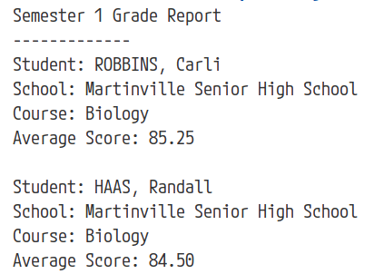

# Python Lists
## Generating Grade Reports

### Getting Started
- Duplicate the starter repo
- Name your GitHub repo: **lists-mc**
    - Upload your finished code to your repo
    - **No need to share your repo with your teacher**
    - Teacher will check your code today **during Teacher Time**
---

### Overview

Write a Python script that uses **multiple lists** to generate a simple First Semester grade report for two high school students.

- Begin with empty lists

- You choose the student names, school name, course name, and the four (4) test scores **per student** Python will use to calculate each student's **average** test score.

- **REQUIRED**: Use the `append()` method to add each student's data to the correct list.

- **REQUIRED**: Use the `len()` and `sum()` functions as needed to help Python calculate each student's **average** test score.

- Format your grade reports as shown.

